# kottans-frontend

## Конспект stage0

1. [Git & GitHub](#git)
2. [Linux CLI, and HTTP](#linux-cli-and-http)
3. [Git for Team Collaboration](#git-for-team-collaboration)
4. [Intro to HTML and CSS](#intro-to-html-and-css)
5. [Responsive Web Design](#responsive-web-design)

    5.1 [HTML CSS Practice](#html-css-practice)

6. [JS Basics](#js-basics)
7. [JS DOM](#dom)


----

> ***12 октября 2020***

## GIT

**GIT** - специальная программа, позволяющая контролировать изменения файлов.

#### Основные возможности

* Возврат к любой версии кода из прошлого
* Просмотр истории изменений и восстановление любых данных
* Совместная работа разработчиков без боязни потерять данные или затереть чужую работу

> Git в современном мире стал универсальным инструментом, с которого начинается практически любой проект в разработке. Вся существующая экосистема инструментов построена именно вокруг git (git интегрирован во все редакторы кода) и онлайн-сервисов, которые с ним интегрированы, например, https://github.com или https://gitlab.com. Как правило, код проектов хранится именно на этих сайтах, обеспечивая команду и совместным доступом, и копией на случай поломки компьютеров.

----

## Linux CLI, and HTTP

### Linux CLI
<details>
<summary>Screenshots</summary>

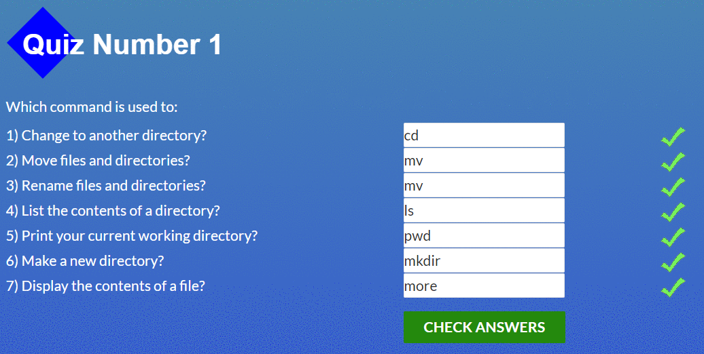
</details>


***Интерфейс командной строки Линукс aka командная строка*** - универсальный интерфейс управления операционными системами на основе Linux, и некоторыми другими POSIX системами. Кстати, терминал и командный интерпретатор (CLI) - разные понятия. Терминал - программа которая эмулирует поведение *железного* терминала.
CLI - программа для управления ОС.

От реализации к реализации команды интерпретатора могут отличаться, но принцип одинаков для всех.

> *Освой один - освоишь все*.

Опишу самые популярные консольные команды:

* **pwd, cd, ls**. Текущая директория, смена директории и список файлов - навигация по файловой системе.

* **mkdir, touch**. Создание директории и создание файла(сама по себе команда **touch** меняет дату последнего изменения файла, побочный эффект этой команды - создание файла. Одна из тех команд, которые используются ради своего побочного действия, а не основного).

* **cat**. Быстрый способ посмотреть содержимое файла. Если передать второй аргумент, cat конкатенирует содержимое этих файлов.

* **grep**. Поиск по файлу или файлам определенного типа. Позволяет *гуглить* по файловой системе. Удобно.

etc. ***Тысячи их.***

### HTTP

***HTTP*** протокол передачи гипертекста. Один из столпов всея **web**. Обмен сообщениями с сервером построен по схеме **запрос-ответ**. Клиент начинает соединение отправляя сообщение запроса HTTP, сервер отвечает сообщением ответа HTTP. Текущая версия HTTP 1.1, имеет преимущества перед HTTP 1.0. Ждем HTTP 2.0.

#### Методы запроса:

* **GET:** для получения существующего ресурса.  В URL-адресе содержится вся необходимая информация для определения местонахождения и возвращения ресурса сервером.
* **HEAD:** подобен GET, однако не передается тело сообщения. Он используется для получения заголовков определенного ресурса с сервера, обычно чтобы проверить при помощи временной отметки, не изменился ли ресурс.
* **POST** для создания нового ресурса. Запросы по методу POST обычно содержат данные для создания нового ресурса.
* **PUT:** для обновления существующего ресурса. В содержимом могут находиться обновленные данные для ресурса.
* **DELETE:** для удаления существующего ресурса.

#### Коды состояния:

* **200 OK** запрос успешно обработан, все ок.
* **301** объект перемещен на новый url(указывается)
* **400 Bad request** обнаружена ошибка
* **404 Not Found**  объект не найден.

#### Заголовки

> Заголовки должны быть отделены пустой строкой. Две пустых строки - конец сообщения.

Заголовки содержат информацию о куках, коде ответа, длине тела ответа/запроса и тд.

----

## Git for Team Collaboration
<details>
<summary>Screenshots</summary>

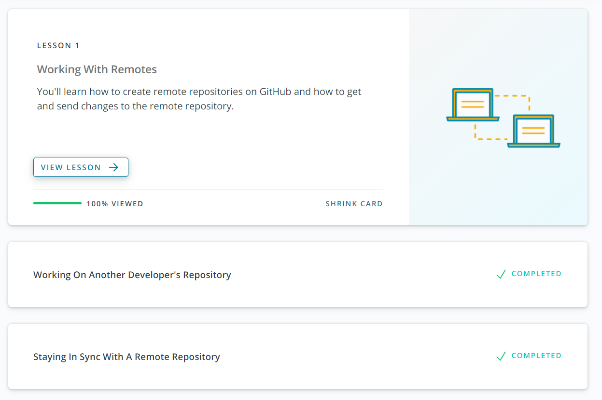
</details>


Самая важная часть git - работа в команде над проектом. В этом помогает Github - один из популярных, если не самый популярный репозиторий кода, и такие команды git как **push, pull, fetch, merge** и другие.

Что не маловажно, git дает возможность смотреть историю коммитов(ну да, ведь он на этом построен) с помощью команды **log**.

[Back](#kottans-frontend)

----
> ***13 октября 2020***

## Intro to HTML and CSS

<details>

<summary> Screenshots </summary>

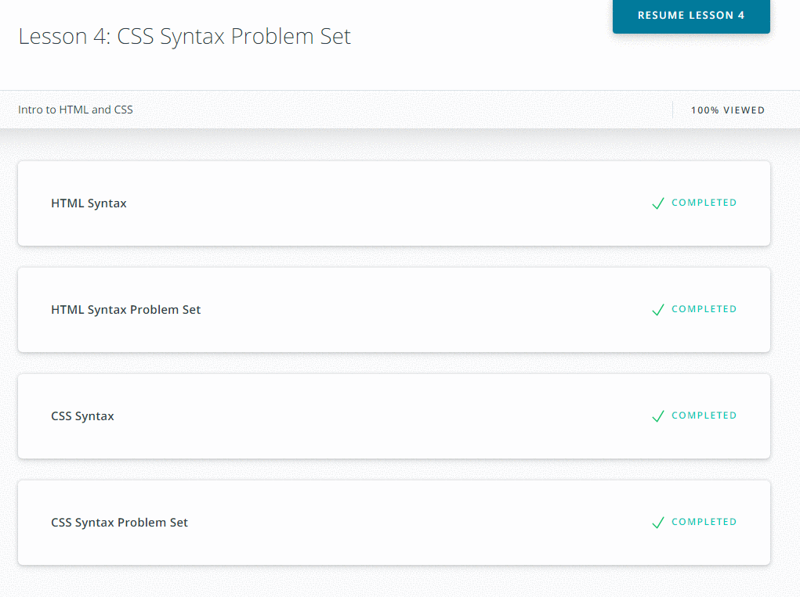

</details>

### HTML

***HTML*** - Hyper Text Markup Language. Язык разметки гипертекста, интерпретируется и отображается браузерами. Его главная задача обозначать семантику данных на странице.
Изначально http задумывался для обмена именно html разметкой между браузером и сервером.
HTML является одним из трех столпов современного веба, на ряду с CSS и Javascript.

#### Структура HTML документа

```html
<!DOCTYPE html>
<html>
  <head>
  </head>
  <body>
  </body>
</html>

```

**doctype** - говорит браузеру как интерпретировать страницу, поскольку html существует в нескольких версиях. ```<!DOCTYPE html>``` - 5 версия html, стандарт для всех современных браузеров.

**head** - хранит элементы, которые призваны помочь браузеру в работе с данными на странице и метатеги, которые хранят информацию для браузеров и поисковых систем. Содержимое тега ```<head>```
не отображается на странице на прямую.

**body** - хранит информацию отображаемую на странице. Вся информация семантически разбивается тегами.

Браузер автоматически добавит любой из этих тегов если он будет отсутствовать. Правильное отображение в таком случае **не гарантируется**.

#### Теги в head

* **title** - название странице, отображается как название вкладки этой страницы.
* **meta** - хранит информацию для браузера и поисковых систем. Ключевые слова, описание сайта, кодировка.
* **link** - подключение внешних файлов. В основном используется для подключения CSS файлов.
* **style** - применяется для определения стилей элементов веб-страницы.
* **script** - применяется для определения **поведения** элементов веб-страницы, может содержать ссылку на программу или ее текст на определенном языке. Может располагаться не только в head, но и в body.

#### Теги разметки в body

Часть основных тегов для разметки. Полное описание всех тегов [Mozila Developer Network](https://developer.mozilla.org/ru/).

**Заголовки ```<h1> - <h6>```** - обозначают заголовок семантического блока. По размеру от 1(Самый большой) до 6(самый маленький).

**Параграф ```<p>```** - выделяют блок текста в качестве параграфа.

**Блок ```<div>```** - блочный элемент, для разделения верстки.

**Ссылка-якорь ```<a>```** - элемент ссылка, для перехода между страниц и навигации по документу.

**Списки** - ```<ul>``` ненумерованный список, ```<ol>``` нумерованный. ```<li>``` элемент списка.

**Изображение ``````** - добавляет на страницу изображение из источника.

**Таблицы ```<table>```** - состоят из тегов:

  ``` html
    <thead> - заголовок таблицы
      <th> - элемент заголовка
    <tbody> - тело таблицы
    <tr> - строка таблицы
    <td> - элемент таблицы
  ```

  пример таблицы:

  ```html
    <table>
      <thead>
        <tr>
          <th>Я заголовок таблицы</th>
          <th>Я заголовок таблицы</th>
          <th>Я заголовок таблицы</th>
        </tr>
      </thead>
      <tbody>
        <tr>
          <th>Я элемент таблицы</th>
          <th>Я элемент таблицы</th>
          <th>Я элемент таблицы</th>
        </tr>
      </tbody>
    </table>
  ```

|  Я заголовок таблицы  | Я заголовок таблицы  | Я заголовок таблицы |
| --------------------- | -------------------- | ------------------- |
| Я элемент таблицы     | Я элемент таблицы    |   Я элемент таблицы |

**Формы ```<form>```** - элемент для сбора данных и последующей обработки на сервере или на месте.
 Может содержать:

 ```html
  <input> - основной элемент ввода данных, в зависимости от аттрибутов принимает различные формы.
  <textarea> - поле для ввода текста
  <select> - выпадающий список
  <label> - подпись для элемента
  <datalist> - может аккумулировать данные введенные в input
  <button> - кнопка, по умолчанию выполняет функцию submit
 ```

#### Семантический html

Подход к созданию веб-страниц с использованием тегов, введенных в html 5, в соответствии с их предназначением. Название тегов говорит само за себя.

```html
  <header>
  <nav>
  <main>
  <section>
  <article>
  <aside>
  <footer>
  и другие
```

[Back](#kottans-frontend)

----

### Cascading Style Sheets

**CSS** отвечает за визуальную составляющую веб-страницы. Используя синтаксис CSS, можно менять внешний вид любых html элементов и псевдо-элементов:


**Селектор (Selector)**
Имя HTML элемента в начале набора правил. Он выбирает элемент(ы) для применения стиля (в данном случае, элементы p ). Для стилизации другого элемента, просто измените селектор.

**Объявление (Declaration)**
Единственное правило, например color: red; указывает, какие из свойств элемента вы хотите стилизовать.

**Свойства (Properties)**
Способы, которыми вы можете стилизовать определенный HTML элемент (в данном случае, *color* является свойством для элементов ```<p>```). В CSS вы выбираете, какие свойства вы хотите затронуть в вашем правиле.

**Значение свойства (Property value)**
Справа от свойства, после двоеточия, у нас есть значение свойства, который выбирает одно из множества возможных значений для данного свойства (существует множество значений *color*, помимо *red*).

Стили могут быть внутри элемента:

```html
<p style="color:red"></p> инлайн стиль.
```

Внутри тега ```<style>```:

```html
  глобальные стили
  <head>
    <style>
      p {
        color: red;
      }
    </style>
  </head>
```

Стили из файлов css подключаются через тег ```<link>``` в head:

```html
<link href="styles/style.css" rel="stylesheet" type="text/css">
```

Приоритет применения стилей к html элементам:

Инлайн стили имеют **приоритет** над Глобальными стилями которые имеют **приоритет** над Внешними стилями.

Правило CSS **!important** используется в объявлениях для переопределения любых других объявлений для свойства, и игнорирования специфики селектора. Правила **!important** гарантируют, что конкретное объявление всегда применяется к сопоставленным элементам. Однако, как правило, лучше избегать использования **!important** как плохой практики.

**Селекторы** - селекторов много, на все случаи жизни все их можно узнать на сайте MDN. Основные:

* Селектор элемента - определяется именем html элемента.
* Селектор класса - определяется атрибутом **class** html элемента, в css доступен через точку ```.class-selector```. Элемент может иметь сколько угодно классов.
* Селектор по идентификатору -  - определяется атрибутом **id** html элемента, доступен через хэш ```#class-selector```.

>***14 октября 2020***.

#### Работа с текстом

```font-size``` - размер текста

```font-family``` - семейство шрифтов, перечисляются через запятую, если какой-то из шрифтов отсутствует, используется следующий из списка. Последним указывается семейство шрифтов.
```font-style``` - изменяет стиль текста на курсив.
```font-weight``` - изменяет жирность текста.
```line-height``` - устанавливает величину пространства между строками.
```color``` - устанавливает цвет текста. Принимаются словесные названия(blue, red, black), хэш( #aa33dd), hsl, rgb.
```text-align``` - выравнивание текста.

#### Блочная модель документа*


Большинство HTML элементов на странице можно рассматривать как блоки, расположенные друг над другом.

Свойство CSS display определяет тип для элемента. Наиболее распространенные значения этого свойства: block, inline и inline-block.

Каждый из блоков, занимающий пространство на вашей странице имеет такие свойства, как:

* padding, пространство только вокруг контента (например, вокруг абзаца текста)
* border, сплошная линия, которая расположена рядом с padding
* margin, пространство вокруг внешней стороны элемента
* width (ширину элемента)
* background-color, цвет позади контента и padding элементов
* text-shadow: устанавливает тень на тексте внутри элемента

#### Позиционирование

>position: *absolute*

Абсолютное значение для позиции свойства CSS позволяет элементу игнорировать элементы-близнецы и вместо этого размещать их относительно ближайшего родительского элемента, который позиционируется как относительный или абсолютный. absolute значение полностью удаляет элемент из потока документов. Используя атрибуты позиционирования top, left, right, bottom, элемент можно расположить в любом месте, как ожидалось.

>position: *relative*

Относительное значение свойства CSS position позволяет позиционировать элемент относительно того места, где он изначально находился на веб-странице. Свойства смещения можно использовать для определения фактического положения элемента относительно его исходного положения. Без свойств смещения это объявление не повлияет на его позиционирование, оно будет действовать как статическое значение по умолчанию для свойства position.

>position: fixed

Когда позиция CSS имеет значение fixed, она устанавливается / закрепляется в определенном месте на странице. Фиксированный элемент остается неизменным независимо от прокрутки. Панель навигации - отличный пример элемента, который часто устанавливается на position: fixed, позволяя пользователю прокручивать веб-страницу и при этом получать доступ к панели навигации.

>float

Свойство CSS float определяет, как далеко влево или вправо элемент должен плавать внутри своего родительского элемента. Значение left перемещает элемент в левую часть его контейнера, а значение right перемещает элемент в правую сторону его контейнера. Для свойства float необходимо указать ширину контейнера, иначе элемент примет всю ширину содержащего его элемента. Элемент "выпадает" из общего потока документа.

>z-index

Свойство CSS z-index указывает, как дальше(глубже) или ближе будет отображаться элемент на веб-странице, когда он перекрывает другие элементы. Свойство z-index использует целочисленные значения, которые могут быть положительными или отрицательными. Элемент с наибольшим значением z-индекса будет на переднем плане, а элемент с наименьшим значением z-индекса будет на заднем плане.

[Back](#kottans-frontend)
----

## Responsive Web Design

### Основы адаптивного дизайна

<details>
<summary>Screenshots</summary>

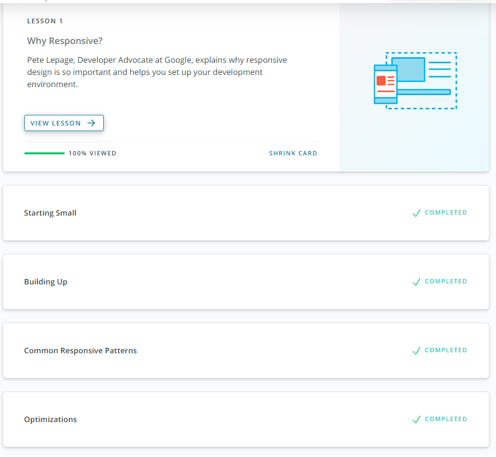

</details>

Добавить отзыв

### Flexbox

<details>
<summary>Screenshots</summary>

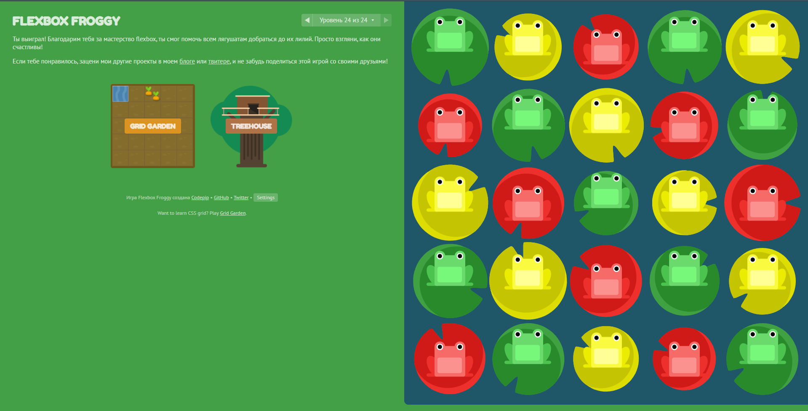

</details>


#### Grid

CSS Grid Layout (также известный как «Grid») - это двумерная система компоновки на основе сетки, цель которой - не что иное, как полное изменение способа разработки пользовательских интерфейсов на основе сетки. CSS всегда использовался для компоновки наших веб-страниц, но никогда не делал этого хорошо. [Подробный гайд](https://css-tricks.com/snippets/css/complete-guide-grid)

#### Flex

Основная идея гибкого макета заключается в том, чтобы дать контейнеру возможность изменять ширину / высоту (и порядок) своих элементов, чтобы наилучшим образом заполнить доступное пространство (в основном, чтобы соответствовать всем типам устройств отображения и размерам экрана). Гибкий контейнер расширяет элементы, чтобы заполнить доступное свободное пространство, или сжимает их, чтобы предотвратить переполнение. [Подробный гайд](https://css-tricks.com/snippets/css/a-guide-to-flexbox/)

[Back](#kottans-frontend)

----

## HTML CSS practice

### HTML-CSS-Popup

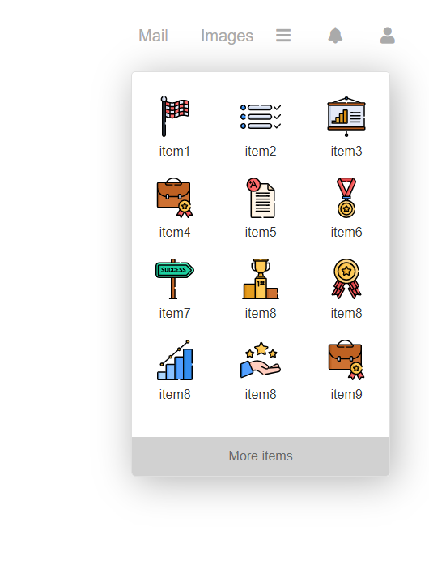

[Demo](https://mustbefail.github.io/frontend-2021-homeworks/submissions/mustbefail/html-css-popup/)

[Code](https://github.com/mustbefail/frontend-2021-homeworks/tree/html-css-popup)

>***23 октября 2020***

## JS Basics

добавь конспект

<details>
<summary>Screenshots</summary>

### IntroJS Udacity
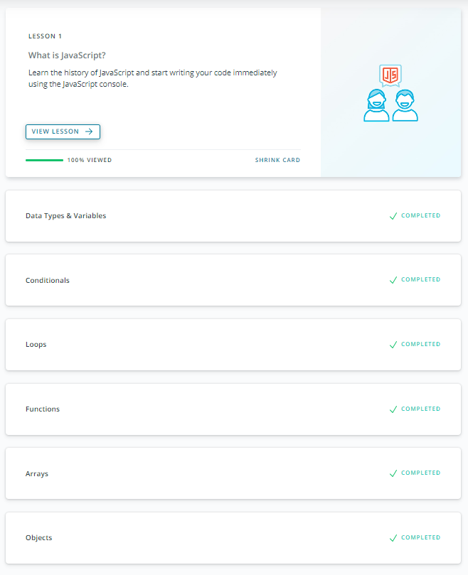

### IntroJS FreeCodeCamp
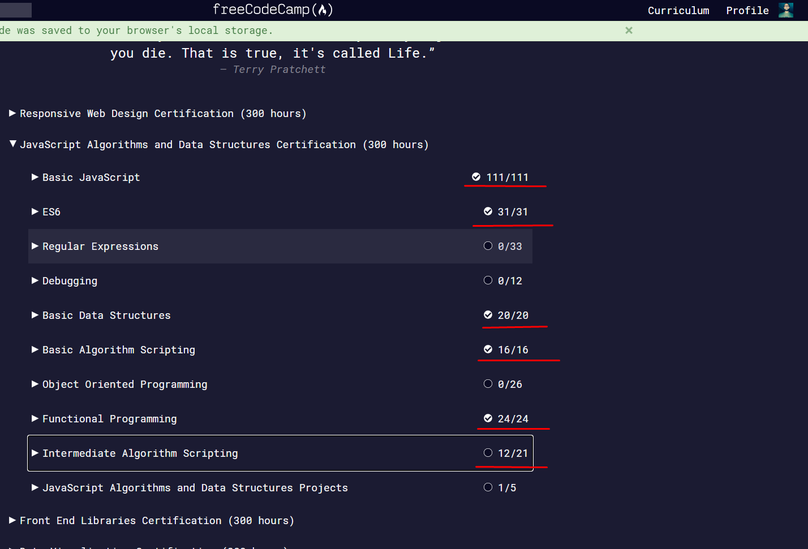
</details>


>***26 октября 2020***

## DOM

### Udacity DOM

<details>
<summary>Screenshots</summary>

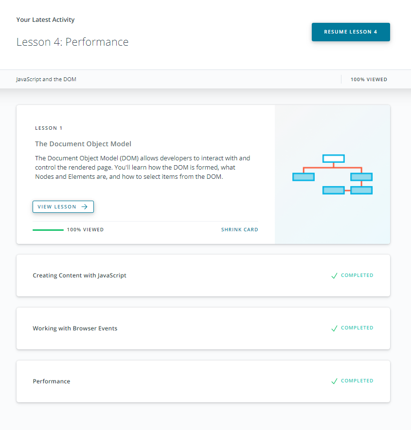

</details>

### FreeCodeCamp

<details>
<summary>Screenshots</summary>

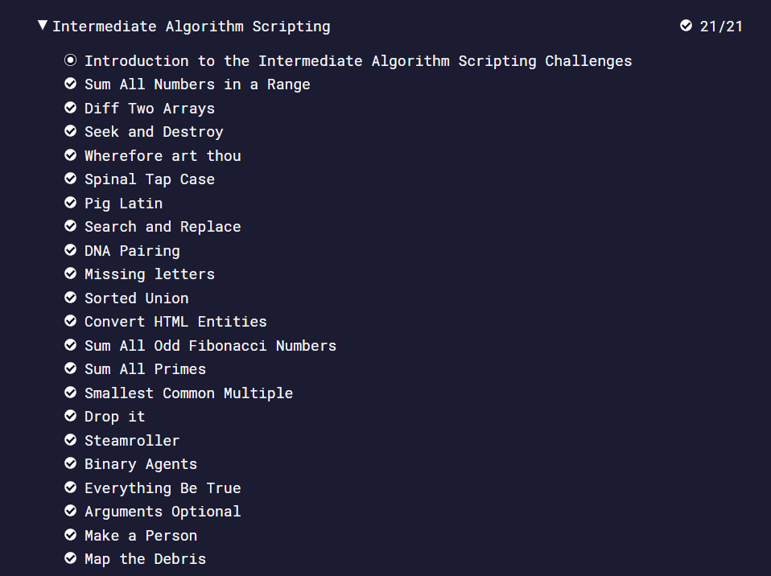

</details>


### JS DOM task(sidebar)

<details>
<summary>Screenshots</summary>

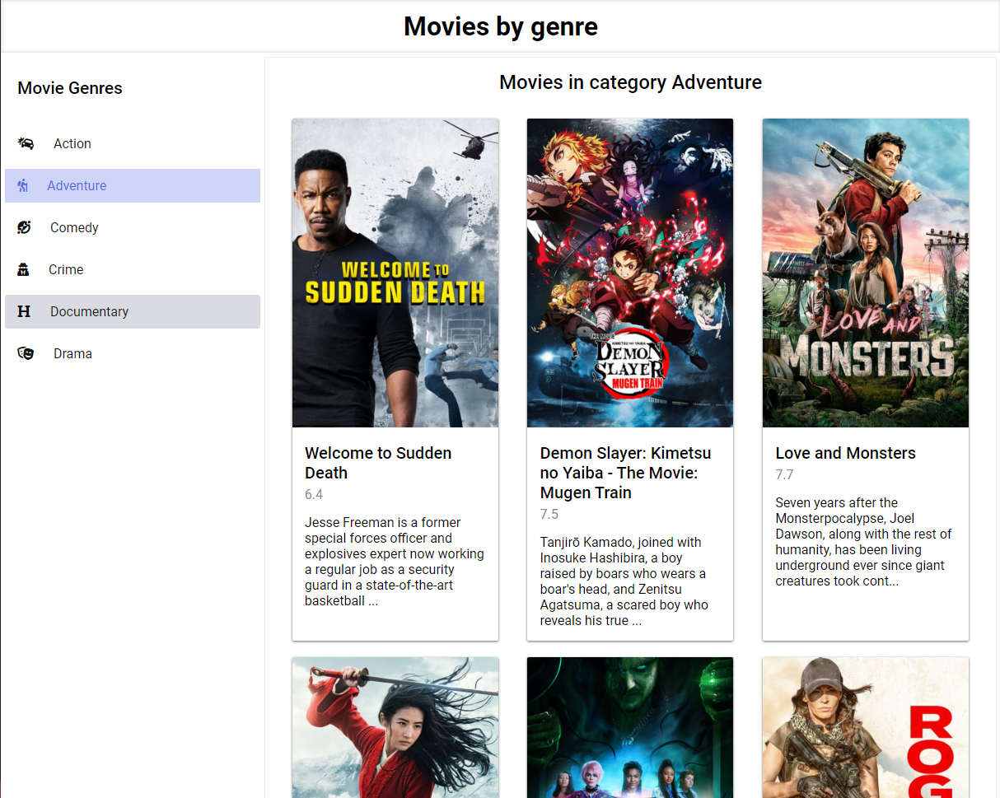

[Demo](https://mustbefail.github.io/frontend-2021-homeworks/submissions/mustbefail/dom-api-task/)

[Code](https://github.com/mustbefail/frontend-2021-homeworks/tree/dom-api-task/submissions/mustbefail/dom-api-task)

</details>